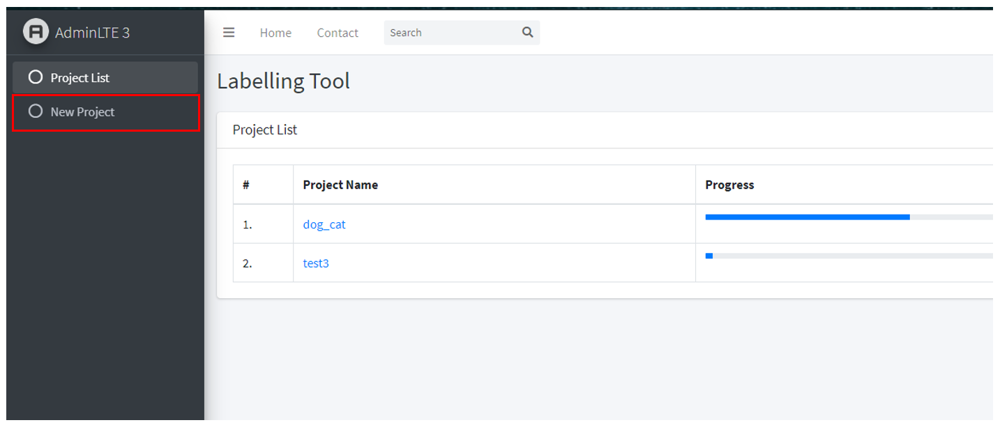
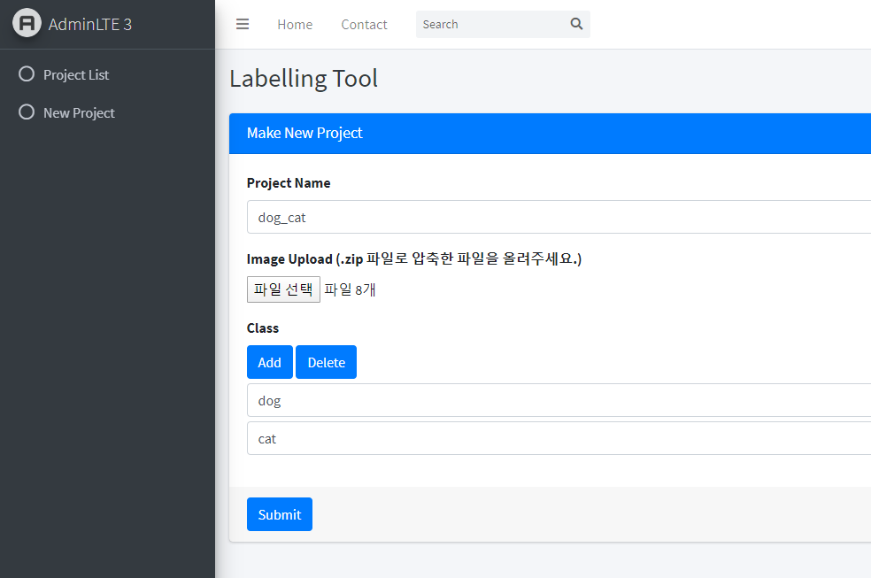
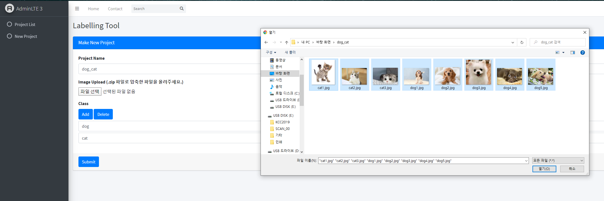
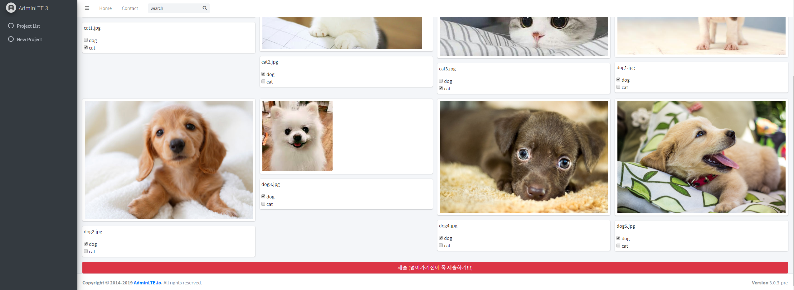
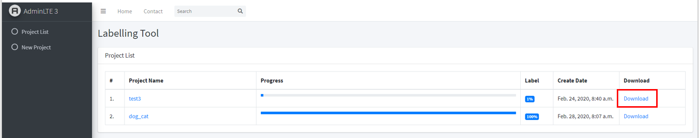
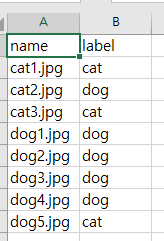

### 소개 
---
- 딥러닝을 사용해 모델을 만들기 위해서는 많은 양의 라벨링된 데이터가 필요합니다.
- 본 프로그램은 데이터의 라벨링 작업을 쉽게 도와주기 위한 도구로써 Django 기반의 웹페이지입니다.
- 기존에는 엑셀과 같은 툴을 사용해 입력했다면 본 프로그램은 클릭만으로 이미지에 라벨링 값을 부여할 수 있습니다.
- 본 프로그램은 Django와 sqlite3를 사용했으며 django를 사용할 줄 모르는 사람도 사용할 수 있도록 최대한 간단히 작동할 수 있게 만들었습니다.

### 주의 사항
---
- New Project를 생성할 경우 Project Name은 이전에 생성했던 이름과 중복되지 않아야 합니다.
- 이미지 이름은 가급적 숫자 혹은 영어로 작성해주세요. ( 한글도 상관없으나 깨질 수 있습니다. )

### 환경설정
---
- pip install django~=2.0.0

### 사용법
---

[ 접속 테스트 ]

1. python [manage.py](http://manage.py) runserver 0.0.0.0:8000

2. http://ip주소/polls/project_list  
ex) [http://113.142.171.133:8000/polls/project_list](http://115.145.173.133:8000/polls/project_list)

3. http://ip주소/polls/admin  
ex) [http://113.142.171.133:8000/polls/project_list](http://115.145.173.133:8000/polls/project_list)

4. 접속 테스트 끝나면 데몬으로 계속 띄워두기
(만약 데몬이 아닌 제대로 배포하고 싶다면 wsgi와 nginx를 이용해 제대로 배포하시면 됩니다.)

[ 실제 사용 ]

1. nohup python [manage.py](http://manage.py/) runserver 0.0.0.0:8000
2. New Project 클릭 후 새로운 프로젝트 생성

    

3. New Project 들어간 후 아래의 양식을 전부 채워주세요.

    

    - Project Name : 입력할 때 공백 값 없이 입력해주세요.
    - Image Upload : 이미지 파일 여러개를 한번에 올려주세요.
    - Class : Add 버튼을 눌러 분류하고자 하는 클래스를 입력해주세요. (컨트롤 + A를 누르면 전체 선택 됩니다.)  

        

4. Project List에 들어가 이미지 분류하고 업로드 버튼을 눌러주세요. ( 제출 버튼은 다음 페이지로 넘어가기전에 눌러주시면 됩니다. )

    

5. Project List에 Download 버튼을 누르시면 CSV 파일 결과값을 얻으실 수 있습니다.

    

    

- 서버 죽이는 방법
- ps -al 명령어를 실행 후 살아있는 데몬 PID를 찾아 KILL을 한다.
